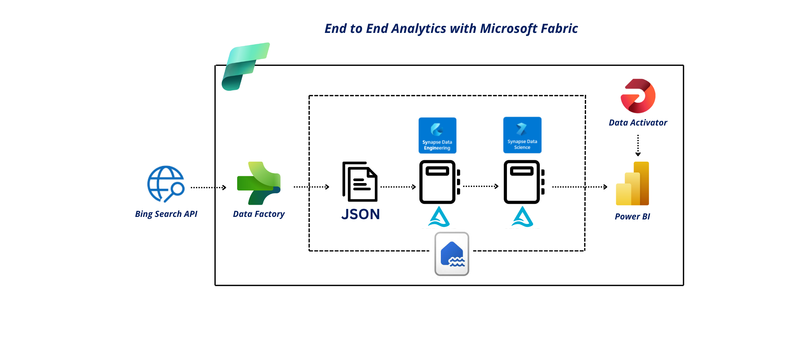

# Malaysia News Sentiment Analytics

## Introduction
This project enables daily monitoring of Malaysia’s media sentiment by dynamically retrieving news articles, processing them using PySpark notebooks, storing structured data in Delta Lake format, and presenting insights via a Power BI dashboard—providing near real-time visibility into public media trends.

The end-to-end data engineering project is orchestrated within Microsoft Fabric, providing centralized data management, processing, modeling, and visualization.

## Architecture Overview
1. **Data Ingestion**: Automatically retrieves up to 100 news articles daily using the Bing News Search API, focused on Malaysia’s latest headlines.

2. **Data Storage**: Stores all retrieved news articles in a Delta Lake within Microsoft Fabric Lakehouse, ensuring structured and scalable storage.

3. **Data Processing**: Uses PySpark Notebooks to:
   - Clean and structure the raw API data.
   - Apply sentiment scoring (Positive, Neutral, Negative, Mixed).
   - Prepare data for reporting in Power BI
    
4. **Semantic Modeling**:
   - Creates semantic models for business-friendly data presentation.
   - Exposes data via SQL Analytics Endpoint for direct querying.

5. **Reporting**: Presents key insights through an interactive Power BI dashboard, showing:
   - Total articles retrieved.
   - Sentiment breakdown.
   - Daily publication trends.
   - Top headlines.
   - Direct clickable access to negative sentiment news.

6. **Monitoring**: Uses Data Activator to trigger alerts when negative sentiment articles spike, enabling proactive response.

## Project Implementation
This project was implemented entirely within the **Microsoft Fabric** ecosystem, integrating data collection, processing, modeling, and reporting into a unified solution.

1. Data is automatically retrieved daily using the **Bing News Search API v7** in **JSON format**.
   - Query parameters:
     - **Dynamic search term** (default: trending news)
     - **Market**: en-MY (English - Malaysia)
     - **Freshness**: Last 24 hours

  

<b></b>

   - Raw JSON responses are stored directly in the <b>Lakehouse</b> as part of the raw data zone.

2. Two **PySpark Notebooks** manage the data processing workflow:
     - `process_bing_news.ipynb`: Parses the raw JSON files retrieved from the Bing News API, structures the data, and stores it as a **Delta Table** in the Lakehouse.
     - `transform_bing_news.ipynb`: Reads the structured Delta Table, applies **sentiment scoring**, adds **reporting-specific** columns, and writes the final enriched dataset back to the Lakehouse in Delta format for reporting use.

3. A **semantic model** is then created using the final Delta Table, enabling business-friendly reporting and analysis. It is further enhanced by adding **custom measures** such as sentiment  percentages to support detailed analysis and interactive reporting in Power BI.
   
4.  The **Power BI dashboard** is built on top of this semantic model to visualize key metrics such as _**sentiment distribution**, **daily news trends**, **top providers**_, and allows users to explore news headlines with _**clickable URLs**_.

5. **Data Activator** triggers notifications when negative sentiment exceeds predefined thresholds of **_0.3 (30%)_**, enabling proactive monitoring.

6. Entire pipeline is scheduled and runs automatically daily at **10am MYT** via Microsoft Fabric scheduler.

## Bing API Role
- Central to real-time news retrieval.
- Ensures authoritative, market-specific, and dynamic news sourcing.
- Eliminates need for manual web scraping.

## Business Impact
- Automated, near real-time media monitoring for Malaysia’s public sentiment.
- Enables organizations to proactively track negative news spikes.
- Reduces manual effort for monitoring, allowing analysts to focus on decision-making.
- Serves as a blueprint for scalable, cloud-native data engineering solutions using Microsoft Fabric.
