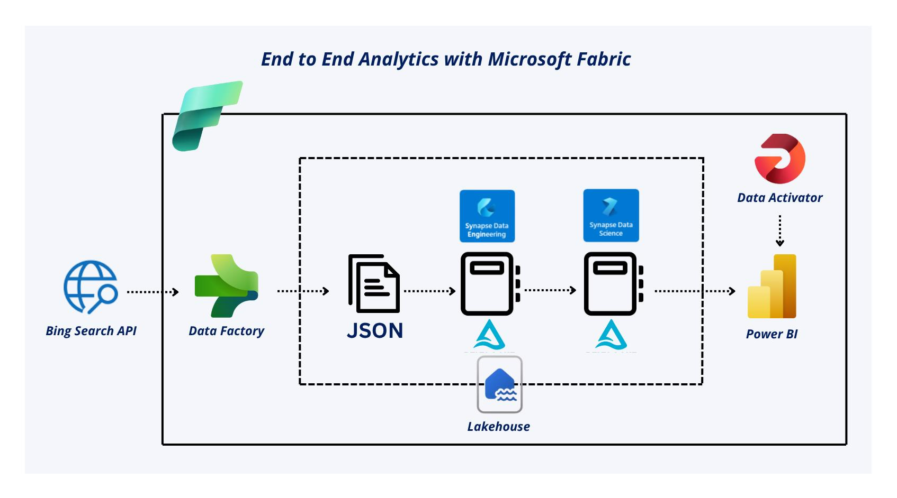

# Malaysia News Sentiment Analytics

## Introduction
This project enables daily monitoring of Malaysia’s media sentiment by dynamically retrieving news articles, processing them using PySpark notebooks, storing structured data in Delta Lake format, and presenting insights via a Power BI dashboard—providing near real-time visibility into public media trends.

The end-to-end data engineering project is orchestrated within Microsoft Fabric, providing centralized data management, processing, modeling, and visualization.

## Project Architecture Overview
1. **Data Ingestion**: Bing News Search API v7 via scheduled pipeline

2. **Data Storage**: Microsoft Fabric Lakehouse (Delta format).

3. **Data Processing**: PySpark Notebooks
   - `process_bing_news.ipynb` (ingests and structures raw JSON)
   - `transform_bing_news.ipynb`(adds sentiment scoring and reporting-related columns)
    
4. **Semantic Modeling**: Lakehouse semantic model and SQL analytics endpoint

5. **Reporting**: Power BI Dashboard

6. **Monitoring**: Real-time negative sentiment detection via Data Activator

## Dashboard Preview

Key Metrics Displayed:
- **Total Articles Retrieved**
- **Top Publisher (News Source)**
- **Sentiment Breakdown**
  - Negative Sentiment (%)
  - Neutral Sentiment (%)
  - Positive Sentiment (%)
  - Mixed Sentiment (%)
- **Sentiment Distribution**
- **Latest Top Headlines**
- **Articles by Publisher**
- **Publication Trends Over Time**

## Project Implementation
1. 

## Business Impact
- Automated, near real-time media monitoring for Malaysia’s public sentiment.
- Enables organizations to proactively track negative news spikes.
- Reduces manual effort for monitoring, allowing analysts to focus on decision-making.
- Serves as a blueprint for scalable, cloud-native data engineering solutions using Microsoft Fabric.
